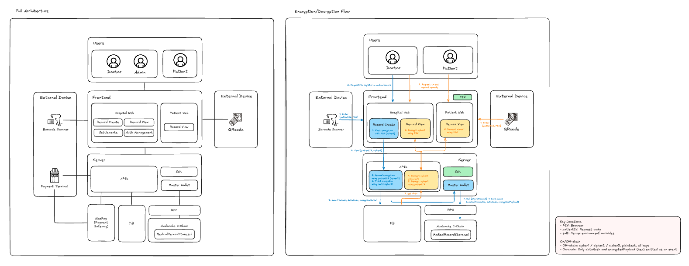

# MI;Re 🦷🔗

Avalanche 블록체인 기반 **임플란트 진료 기록 보존·연계 플랫폼**

---

### 배포 링크 / 데모 영상 (Links & Demo)

- **Product Walkthrough:** [YouTube 또는 Video 링크 삽입]
- **Live Demo - Hospital Portal:** [https://mire-nx-hospital-web.vercel.app](https://mire-nx-hospital-web.vercel.app)
- **Live Demo - Patient Portal:** [https://mire-nx-patient-web.vercel.app](https://mire-nx-patient-web.vercel.app)
- **Smart Contract (Fuji Testnet):** [0x2A6bB4491a2eEA1415134D058426f3fD3DbD6475](https://testnet.snowtrace.io/address/0x2A6bB4491a2eEA1415134D058426f3fD3DbD6475) | [Snowtrace에서 보기](https://testnet.snowtrace.io/address/0x2A6bB4491a2eEA1415134D058426f3fD3DbD6475)

#### 테스트용 더미 계정

아래 계정으로 로그인해 데모를 체험하실 수 있습니다. **비밀번호는 모두 `admin123!` 로 동일합니다.**

| 구분                          | 이메일             |
| ----------------------------- | ------------------ |
| 슈퍼 어드민                   | admin@mire.com     |
| 더미 대학병원 (마스터 어드민) | mire@example.com   |
| 더미 일반병원 (마스터 어드민) | prime@example.com  |
| 더미 일반병원 (일반)          | prime2@example.com |

#### 환자용 링크 형식

환자 포털은 `?patientId=환자ID#PIN번호` 형식으로 접속합니다. 진료 기록 등록 시 사용한 환자 ID를 그대로 넣으시면 됩니다.

- 예: `https://mire-nx-patient-web.vercel.app/?patientId=DUMMYID#123456`

⚠️ 데모 환경에서 환자 기록 복호화·조회 시 테스트용 미르링크 카드 PIN이 필요할 수 있습니다.

_데모 전용 계정이며, 평가 후 비활성화될 수 있습니다._

---

## 1. 프로젝트 개요 (Project Overview)

**해결하고자 하는 문제 (The Problem)**  
임플란트는 영구적인 장치가 아니며, 향후 합병증 발생 시 원래의 식립체·보철 부품 정보가 필수적입니다. 그러나 이러한 데이터는 개별 치과 EMR이나 종이 차트에 고립되어 있고, 병원 폐업·환자 이사 시 유실되어 치료 지연, 불필요한 제거, 의료비 증가로 이어집니다. 병원 수명을 넘어 임플란트 기록을 보존할 글로벌 인프라는 부재한 상황입니다.

**MI;Re의 솔루션 (The Solution)**  
MI;Re(MirLink)는 환자 식별 정보(PII)를 철저히 분리하고, **구조화된 임상 데이터의 해시만 온체인에 기록**하여 개인정보 보호와 데이터 무결성을 동시에 보장하는 플랫폼입니다.

- **MVP:** [진료 기록 작성 → 다단계 암호화 → DB 저장 및 온체인 이벤트 기록] End-to-End를 구현했습니다.
- **제로 트러스트:** 환자의 물리적 동의(미르링크 카드 스캔) 없이는 병원·환자 모두 데이터에 접근할 수 없습니다.

---

## 2. Why Avalanche?

엔터프라이즈급 헬스케어 인프라로의 확장을 위해 Avalanche를 전략적으로 사용합니다.

- **Phase 1 – C-Chain 검증 (현재 MVP)**  
  Avalanche C-Chain(Fuji Testnet)의 EVM 호환성, 빠른 확정성(Sub-second finality), 낮은 가스비를 활용해 대량의 진료 기록을 처리합니다. 스마트 컨트랙트(`MedicalRecordStore.sol`)는 `onlyOwner`로 진료기록 ID·데이터 해시·암호화 페이로드를 이벤트로 안전하게 기록합니다.

- **Phase 2 – Healthcare Subnet (미래)**  
  병원 참여 확대와 규제 요구에 맞춰 Avalanche Subnet SDK로 헬스케어 전용 서브넷을 구축할 계획입니다. 검증인·트랜잭션 정책·가스비를 의료 규제에 맞게 조정할 수 있습니다.

- **보이지 않는 Web3 (Invisible Web3)**  
  B2B 의료 현장 도입 장벽을 줄이기 위해, 중앙 '마스터 지갑'이 백그라운드에서 서명·가스비(AVAX)를 대납합니다. 의사·데스크는 메타마스크나 시드 없이 기존 웹 EMR처럼 사용할 수 있습니다.

---

## 3. 작동 방식 – 핵심 유저 여정 (How It Works)

1. **환자 온보딩:** 치과 진료 후 실물 미르링크 바코드 카드 발급
2. **마찰 없는 차팅:** 의사는 파트너 웹 EMR에서 임플란트 픽스처 규격 등 진료 정보 입력
3. **결제 기반 온체인 기록:** 오프라인 POS 결제 완료 시 승인 신호로 아발란체에 데이터 해시 자동 기록
4. **리워드 분배:** 서비스 등록비 일부가 양질의 임상 데이터를 기록한 병원에 리워드로 분배
5. **데이터 주권:** 환자는 전용 웹 앱에서 위변조 불가한 진료 이력 조회, 타 병원 방문 시 제시해 과잉·중복 진료 예방

---

## 4. 프로젝트 구조 (Monorepo)

```
mire-nx-workspace/
├── apps/
│   ├── hospital-web/    ← 운영사/병원 웹
│   └── patient-web/     ← 환자 웹
├── packages/
│   ├── database/        ← Prisma 공통 모듈 (스키마, 클라이언트, 마이그레이션)
│   ├── blockchain/      ← wagmi 3 + viem 2 (Avalanche 체인, 컨트랙트)
│   └── ui/              ← shadcn/ui 공통 컴포넌트
├── nx.json
├── package.json
└── tsconfig.base.json
```

---

## 5. 사용 기술 및 아키텍처

### 사용 기술

| 구분            | 기술                                                                                                          |
| --------------- | ------------------------------------------------------------------------------------------------------------- |
| Frontend        | Next.js 16 (App Router), React 19, TypeScript, Tailwind CSS v4, shadcn/ui, Nx Monorepo                        |
| Backend / DB    | Next.js API Routes, Server Actions, Prisma 7, NeonDB (Serverless PostgreSQL)                                  |
| Smart Contracts | Solidity 0.8.20 (`MedicalRecordStore.sol`)                                                                    |
| Chain           | Avalanche C-Chain / Fuji Testnet, viem 2.x, wagmi 3.x                                                         |
| 보안·암호화     | NextAuth v5, 오프체인 3단계 암호화(PIN → patientId → server salt). 온체인에는 해시·암호문만 기록, 평문 미저장 |

### 아키텍처 다이어그램



---

## 6. 실행 방법 (How to Run)

### 요구사항

- **Node.js** v20 이상
- **npm**
- **PostgreSQL** (NeonDB 또는 로컬 Postgres 권장)

### 단계별 실행

```bash
# 1) 저장소 클론
git clone <저장소 URL>
cd mire-nx-workspace

# 2) 의존성 설치
npm install

# 3) 환경 변수 설정
# 루트 또는 각 앱 디렉터리에 .env / .env.local 생성 후 .env.example 참고하여 설정
# 필수: AUTH_SECRET, DATABASE_URL, DIRECT_URL, JWT_SECRET
# 블록체인: NEXT_PUBLIC_CHAIN_ID(예: 43113 Fuji), NEXT_PUBLIC_APP_URL
# packages/database/.env 에도 DATABASE_URL, DIRECT_URL 설정 (마이그레이션용)

# 4) DB 마이그레이션
npm run db:migrate:dev
# (이미 배포된 DB만 사용 시) npm run db:migrate:deploy

# 5) (선택) 시드 데이터로 데모 체험
npm run db:seed

# 6) 개발 서버 실행
npm run dev:hospital   # 병원 웹 → http://localhost:3000
npm run dev:patient    # 환자 웹 → 별도 터미널에서 실행 (포트 자동 할당)
```

### 주요 명령어

| 명령                     | 용도                   |
| ------------------------ | ---------------------- |
| `npm run dev:hospital`   | 병원용 웹 개발 서버    |
| `npm run dev:patient`    | 환자용 웹 개발 서버    |
| `npm run build:all`      | 양쪽 앱 동시 빌드      |
| `npm run db:migrate:dev` | DB 마이그레이션 (개발) |
| `npm run db:seed`        | 데모 시드 데이터       |
| `npm run db:studio`      | Prisma Studio          |
