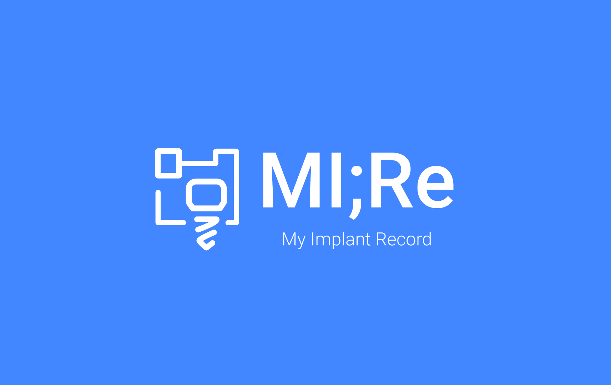

# MI;Re 🦷🔗

<p align="center" style="font-size: 1.6rem; margin: 1.25rem;">
  Avalanche blockchain-based<br/> <strong style="font-size: 2.2rem;">Implant care record preservation & linkage platform</strong>
</p>



---

### Links & Demo

- **Product Walkthrough:** [TBD]
- **Live Demo - Hospital Portal:** [https://mire-nx-hospital-web.vercel.app](https://mire-nx-hospital-web.vercel.app)
- **Live Demo - Patient Portal:** [https://mire-nx-patient-web.vercel.app](https://mire-nx-patient-web.vercel.app)
- **Smart Contract (Fuji Testnet):** [0x2A6bB4491a2eEA1415134D058426f3fD3DbD6475](https://testnet.snowtrace.io/address/0x2A6bB4491a2eEA1415134D058426f3fD3DbD6475) | [View on Snowtrace](https://testnet.snowtrace.io/address/0x2A6bB4491a2eEA1415134D058426f3fD3DbD6475)

### Test dummy accounts

You can log in with the accounts below to try the demo.

| Role                                     | Email              |
| ---------------------------------------- | ------------------ |
| Super Admin                              | admin@mire.com     |
| Dummy university hospital (Master Admin) | mire@example.com   |
| Dummy general hospital (Master Admin)    | prime@example.com  |
| Dummy general hospital (Staff)           | prime2@example.com |

_All passwords are `admin123!`._

### Patient portal link format

The patient portal is accessed with `?patientId=PatientID#PIN`. Use the same patient ID that was used when registering the care record.

- Example: `https://mire-nx-patient-web.vercel.app/?patientId=DUMMYID#123456`

---

## 1. Project Overview

**The Problem**  
Dental implants are not permanent devices; in case of future complications, the original fixture and prosthetic component information is essential. Yet this data is siloed in individual dental EMRs or paper charts and is lost when clinics close or patients move, leading to delayed treatment, unnecessary removals, and higher medical costs. There is no global infrastructure to preserve implant records beyond the lifetime of a single clinic.

**The Solution – MI;Re**  
MI;Re strictly separates patient-identifying information (PII) and **records only hashes of structured clinical data on-chain**, ensuring both privacy and data integrity.

- **MVP:** End-to-end flow implemented: [care record creation → multi-stage encryption → DB storage and on-chain event logging].
- **Zero trust:** Neither clinics nor patients can access data without the patient’s physical consent (MI;Re card scan).

---

## 2. Why Avalanche?

Avalanche is used strategically to scale toward enterprise-grade healthcare infrastructure.

- **Phase 1 – C-Chain validation (current MVP)**  
  Leverages Avalanche C-Chain (Fuji Testnet) EVM compatibility, sub-second finality, and low gas costs to process high volumes of care records. The smart contract (`MedicalRecordStore.sol`) safely logs record IDs, data hashes, and encrypted payloads as events under `onlyOwner`.

- **Phase 2 – Healthcare Subnet (future)**  
  As more hospitals join and regulatory requirements grow, we plan to build a healthcare-dedicated subnet with the Avalanche Subnet SDK, tuning validators, transaction policies, and gas for medical compliance.

- **Invisible Web3**  
  To lower adoption barriers in B2B clinical settings, a central “master wallet” signs and pays gas (AVAX) in the background. Doctors and front-desk staff can use the system like a conventional web EMR—no MetaMask or seed phrases required.

---

## 3. How It Works – Core user journey

1. **Patient onboarding:** After dental treatment, a physical MI;Re barcode card is issued.
2. **Frictionless charting:** Dentists enter implant fixture specs and other care data in the partner web EMR.
3. **Payment-triggered on-chain recording:** When offline POS payment completes, an approval signal triggers automatic recording of data hashes on Avalanche.
4. **Reward distribution:** A portion of service registration fees is distributed as rewards to clinics that record high-quality clinical data.
5. **Data sovereignty:** Patients view tamper-proof care history in a dedicated web app and can present it at other clinics to avoid over- or duplicate treatment.

---

## 4. Project structure (Monorepo)

```
mire-nx-workspace/
├── apps/
│   ├── hospital-web/    ← Operator / hospital web
│   └── patient-web/     ← Patient web
├── packages/
│   ├── database/        ← Shared Prisma (schema, client, migrations)
│   ├── blockchain/      ← wagmi 3 + viem 2 (Avalanche chains, contracts)
│   └── ui/              ← shadcn/ui shared components
├── nx.json
├── package.json
└── tsconfig.base.json
```

---

## 5. Tech stack & architecture

### Tech stack

| Category          | Technology                                                                                                                      |
| ----------------- | ------------------------------------------------------------------------------------------------------------------------------- |
| Frontend          | Next.js 16 (App Router), React 19, TypeScript, Tailwind CSS v4, shadcn/ui, Nx Monorepo                                          |
| Backend / DB      | Next.js API Routes, Server Actions, Prisma 7, NeonDB (Serverless PostgreSQL)                                                    |
| Smart Contracts   | Solidity 0.8.20 (`MedicalRecordStore.sol`)                                                                                      |
| Chain             | Avalanche C-Chain / Fuji Testnet, viem 2.x, wagmi 3.x                                                                           |
| Security / crypto | NextAuth v5, off-chain 3-stage encryption (PIN → patientId → server salt). Only hashes/ciphertext on-chain; no plaintext stored |

### Architecture


---

## 6. How to run

### Requirements

- **Node.js** v20 or higher
- **npm**
- **PostgreSQL** (NeonDB or local Postgres recommended)

### Step-by-step

```bash
# 1) Clone the repository
git clone <repository URL>

# 2) Install dependencies
npm install

# 3) Configure environment variables
# Create .env / .env.local in the root or each app directory; refer to .env.example
# Required: AUTH_SECRET, DATABASE_URL, DIRECT_URL, JWT_SECRET
# Blockchain: NEXT_PUBLIC_CHAIN_ID (e.g. 43113 Fuji), NEXT_PUBLIC_APP_URL
# Also set DATABASE_URL and DIRECT_URL in packages/database/.env (for migrations)

# 4) Run DB migrations
npm run db:migrate:dev
# (If using an already-deployed DB only) npm run db:migrate:deploy

# 5) (Optional) Demo with seed data
npm run db:seed

# 6) Start development servers
npm run dev:hospital   # Hospital web → http://localhost:3000
npm run dev:patient    # Patient web → run in a separate terminal (port auto-assigned)
```

### Main commands

| Command                  | Purpose                    |
| ------------------------ | -------------------------- |
| `npm run dev:hospital`   | Hospital web dev server    |
| `npm run dev:patient`    | Patient web dev server     |
| `npm run build:all`      | Build both apps            |
| `npm run db:migrate:dev` | DB migration (development) |
| `npm run db:seed`        | Demo seed data             |
| `npm run db:studio`      | Prisma Studio              |
